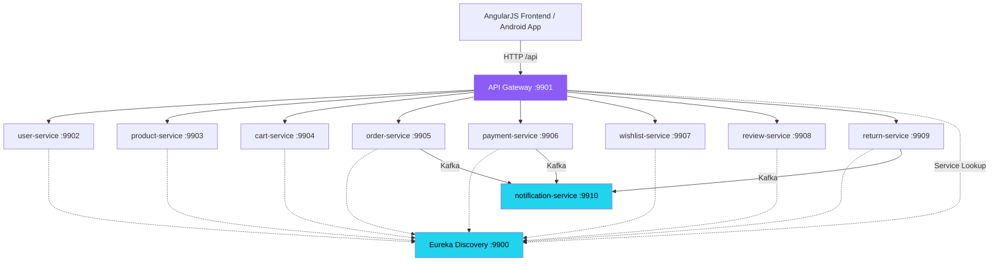

<p align="center">
  
</p>

<p align="center">
  
  
  
  
  
  
  
  
  
  
  
  
  
</p>

<p align="center">
  
</p>

<p align="center">
  
  
  
</p>

---

## 🌐 Live Deployment

> **Deployed on Render** — Single Docker container running all 11 Spring Boot microservices + Nginx + Kafka in KRaft mode.

| Property | Value |
|----------|-------|
| **Live URL** | [https://entitykart-enterprise-ecommerce.onrender.com](https://entitykart-enterprise-ecommerce.onrender.com) |
| **Platform** | [Render](https://render.com) (Docker container, free tier) |
| **Database** | [Aiven Cloud MySQL](https://aiven.io) — managed cloud MySQL (host: `mysql-36ce7779-...aivencloud.com:23778`) |
| **Image Storage** | [Cloudinary](https://cloudinary.com) CDN — cloud name: `ddwrdkpkv` |
| **Payment Gateway** | [Authorize.Net](https://developer.authorize.net) — Sandbox environment |
| **Email (SMTP)** | Gmail SMTP via `mdsadiqueamin721786@gmail.com` — triggers on: registration, order placed, payment confirmed, return processed |
| **Admin Email** | `mdsadiqueamin721721@gmail.com` |

### 📱 APK → Render Connection

The pre-compiled Android APK (`entitykart-android-apk.apk` and `entitykart-flutter-apk.apk`) **automatically connect to the Render deployment** — no Wi-Fi LAN or manual IP configuration needed:

1. Install `entitykart-android-apk.apk` or `entitykart-flutter-apk.apk` on any Android 8+ device (enable "Install from Unknown Sources")
2. Open the app → it loads the AngularJS frontend from local assets
3. All API calls route to `https://entitykart-enterprise-ecommerce.onrender.com`
4. **First launch after Render cold start may take 30–60 seconds** — this is normal for free-tier containers

> **Note:** If you want to test against a local backend on the same Wi-Fi, use the **Docker API / Local API** selector button (top-right of navbar) and enter your PC's LAN IP. This overrides the Render URL until cleared.

### ⚙️ Render Environment Variables Required

Set these in your Render service → **Environment** tab:

```env
# Aiven Cloud MySQL
DB_HOST=mysql-36ce7779-mdsadiqueamin721721-a526.i.aivencloud.com
DB_PORT=23778
DB_NAME=defaultdb
DB_USERNAME=avnadmin
DB_PASSWORD=<your-aiven-password>
DB_SSL_PARAMS=?useSSL=true&requireSSL=true&trustServerCertificate=true

# JWT
JWT_SECRET=<your-super-secret-jwt-key>

# Application URL
APP_URL=https://entitykart-enterprise-ecommerce.onrender.com
ADMIN_EMAIL=mdsadiqueamin721721@gmail.com

# Gmail SMTP (for welcome/order/payment emails)
MAIL_USERNAME=mdsadiqueamin721786@gmail.com
MAIL_PASSWORD=<gmail-app-password>

# Cloudinary (product image upload from Admin Panel)
CLOUDINARY_CLOUD_NAME=ddwrdkpkv
CLOUDINARY_API_KEY=<your-cloudinary-api-key>
CLOUDINARY_API_SECRET=<your-cloudinary-api-secret>

# Authorize.Net Payment Gateway (Sandbox)
AUTHORIZE_NET_API_LOGIN_ID=<your-login-id>
AUTHORIZE_NET_TRANSACTION_KEY=<your-transaction-key>
AUTHORIZE_NET_ENVIRONMENT=sandbox
```

### 📧 Email Notifications (Kafka-driven)

EntityKart sends transactional emails via **Gmail SMTP** triggered by Kafka events:

| Event | Trigger | Email Type |
|-------|---------|------------|
| User registers | `user-events` topic | Welcome email |
| Order placed | `order-events` topic | Order confirmation |
| Payment processed | `payment-events` topic | Payment receipt |
| Return approved/rejected | `return-events` topic | Return status update |

---

## 📖 System Architecture & Design Logic Flow
The Entitykart workspace consists of two main architectural variants:
1. **Monolithic Architecture** ([Entitykart-main](file:///d:/Temp/MKEG/Entitykart-main)): A traditional, single-deployment Spring Boot + Maven system serving JSP templates compiled dynamically by Tomcat Jasper, utilizing stateful `HttpSession` session variables, direct SQL repository updates, and Apache POI for reports.
2. **Microservices Architecture** ([Entitykart](file:///d:/Temp/MKEG/Entitykart)): A modern cloud-ready design splitting domains into 9 independent microservices managed via Netflix Eureka and Spring Cloud Gateway, featuring stateless JWT tokens, event-driven processes via Apache Kafka, and a responsive AngularJS client wrapped in Android & Flutter WebView clients.

> [!TIP]
> For a detailed, step-by-step trace of API endpoints, Kafka topic events, database schemas, and class interactions for **Categories**, **Subcategories**, **Products**, **Orders**, and **Returns**, see the comprehensive **[Architecture & Data Flows Guide](file:///d:/Temp/MKEG/Entitykart/ARCHITECTURE_AND_FLOWS.md)**.

---

## 📌 Overview

**EntityKart** is a modern, cloud‑ready **e‑commerce platform** built with a **microservices architecture**. Refactored into **9 independently deployable services**, an **API Gateway**, **Service Discovery (Eureka)**, and **event‑driven communication via Apache Kafka**. The frontend is a responsive **AngularJS single‑page application**, and there is a native **Android app** (Kotlin + Jetpack Compose + WebView). The entire stack is containerized with **Docker** and automated through **GitHub Actions CI/CD**.

---

## 🏗 Architecture



---

## 🔄 Kafka Event Flow

| Event | Producer | Consumer(s) |
|-------|----------|-------------|
| `user-events` | user-service | notification-service (welcome email) |
| `cart-checkout-events` | cart-service | order-service |
| `order-events` | order-service | payment-service, notification-service |
| `payment-events` | payment-service | notification-service |
| `return-events` | return-service | notification-service |

---

## ✨ Features

- 🔐 **User Management** – Registration, JWT authentication, profile, address book
- 📦 **Product Catalog** – Categories, sub‑categories, inventory, search/filtering, GraphQL
- 🛒 **Shopping Cart** – Add/remove items, quantity update, save-for-later, checkout event
- 🎟️ **Coupon & Promo Codes** – Built-in coupon system with percent/flat discount validation
- 💳 **Checkout & Payment** – Authorize.Net integration, COD, UPI, net banking (per-method validation)
- 📋 **Order Management** – Place, track, cancel, download invoice, view order history
- ❤️ **Wishlist** – Save favourite products with stock status badges
- ⭐ **Reviews & Ratings** – Write/edit/delete reviews, rating statistics, star bar chart
- ↩️ **Returns & Refunds** – Request return, admin approval, automated refund
- 📧 **Notifications** – Email via Gmail SMTP (Kafka-driven, async) + in-app notify-me for out-of-stock
- 👑 **Admin Panel & Telemetry** – Manage products, orders, payments, returns, reviews, export reports (Excel & Word). Features a live dashboard with interactive **Chart.js** telemetry.
- ⚡ **Flash Sale / Deals of the Day** – Animated pulsing badge + live countdown timer on home page
- 🕐 **Recently Viewed Products** – Horizontally scrollable recently viewed section (localStorage-persisted)
- 🔍 **Advanced Filtering** – Price range filter with quick chips, sort by price/discount/newest
- 🖼️ **Image Gallery** – Multi-image thumbnail strip on product detail with zoom-on-hover
- 📤 **Share Product** – Web Share API + clipboard fallback
- 📱 **Mobile Responsive** – Hamburger menu, slide-in nav panel, responsive layouts for all screen sizes
- 🎨 **Orange Premium Theme** – Clean storefront with carousel, stats row, category nav, brand box grids
- 🖼️ **Cloudinary Media Upload** – Upload product images directly from admin panel
- 📱 **Android App** – Native WebView wrapper (Kotlin + Jetpack Compose)
- 🦋 **Flutter App** – Cross-platform WebView with settings screen, bottom nav bar, back-button handling

---

## 🧰 Technology Stack

### Backend

| Category | Technologies |
|----------|--------------|
| Core | Java 17, Spring Boot 3.2, Spring Cloud 2023.0.0 |
| Microservices | Spring Cloud Gateway, Netflix Eureka, OpenFeign |
| Security | Spring Security, JWT (validated at Gateway) |
| Messaging | Apache Kafka (Zookeeper, producers / consumers) |
| Database | MySQL 8 (Aiven Cloud), Spring Data JPA, Hibernate |
| Media | Cloudinary (image upload) |
| Build Tool | Gradle (Kotlin DSL) |

### Frontend

| Technology | Role |
|------------|------|
| AngularJS 1.8 | Single Page Application (SPA) |
| Bootstrap 5 | Responsive UI |
| JavaScript ES6 | Dynamic client logic |
| HTML5 / CSS3 | Structure & styling |
| Font Awesome | Icons |

### Mobile (Android)

| Technology | Role |
|------------|------|
| Kotlin | Language |
| Jetpack Compose | UI framework |
| WebView | Loads AngularJS frontend from assets |
| JavascriptInterface | Native bridge for backend URL injection |

### DevOps & Cloud

| Tool | Purpose |
|------|---------|
| Docker & Docker Compose | Containerization & local orchestration |
| **Render** | **Cloud hosting — single Docker container (all 11 services)** |
| Aiven Cloud | Managed MySQL database (cloud-hosted, SSL required) |
| Cloudinary | Cloud image storage & CDN for product images |
| Authorize.Net | Payment gateway (sandbox & production) |
| Gmail SMTP | Transactional email (Kafka-driven notifications) |
| GitHub Actions | CI/CD – build, test, push images |
| Git / GitHub | Version control & repository hosting |

---

## 🧩 Microservices Port Reference

### Local Development (without Docker)

| Service | Port | Database | Responsibility |
|---------|------|----------|----------------|
| discovery-server | **9900** | – | Eureka service registry |
| api-gateway | **9901** | – | Routing, JWT validation |
| user-service | **9902** | user_service | Users, authentication, JWT |
| product-service | **9903** | product_service | Products, categories, inventory |
| cart-service | **9904** | cart_service | Cart operations, checkout event |
| order-service | **9905** | order_service | Order creation, status |
| payment-service | **9906** | payment_service | Authorize.Net, refunds |
| wishlist-service | **9907** | wishlist_service | Wishlist CRUD |
| review-service | **9908** | review_service | Reviews, ratings |
| return-service | **9909** | return_service | Return requests, refunds |
| notification-service | **9910** | notification_service | Email notifications (Kafka consumer) |

### Docker (port mapping: HOST → CONTAINER)

| Service | Host Port | Container Port |
|---------|-----------|----------------|
| Eureka (Discovery) | 9876 | 8761 |
| API Gateway | 9080 | 8080 |
| User Service | 9081 | 8081 |
| Product Service | 9082 | 8082 |
| Cart Service | 9083 | 8083 |
| Order Service | 9084 | 8084 |
| Payment Service | 9085 | 8085 |
| Wishlist Service | 9086 | 8086 |
| Review Service | 9087 | 8087 |
| Return Service | 9088 | 8088 |
| Notification Service | 9089 | 8089 |

> **Note:** In Docker, each service's `SERVER_PORT` env var overrides the application.yml default.

---

## 📂 Project Structure

```text
Entitykart/
├── common-service/              # Shared JAR (exception handling, Kafka config)
├── discovery-server/            # Eureka server (port 9900 local)
├── api-gateway/                 # Spring Cloud Gateway (port 9901 local)
├── user-service/                # Users, JWT auth (port 9902 local)
├── product-service/             # Products, categories, GraphQL, Cloudinary upload (port 9903 local)
├── cart-service/                # Cart, checkout events (port 9904 local)
├── order-service/               # Orders, status (port 9905 local)
├── payment-service/             # Payments, Authorize.Net (port 9906 local)
├── wishlist-service/            # Wishlist CRUD (port 9907 local)
├── review-service/              # Reviews & ratings (port 9908 local)
├── return-service/              # Returns & refunds (port 9909 local)
├── notification-service/        # Email notifications (port 9910 local)
├── frontend/                    # AngularJS SPA
│   ├── index.html
│   ├── css/style.css
│   ├── js/
│   │   ├── app.js
│   │   ├── controllers/
│   │   └── services/
│   └── views/                   # HTML partials
├── android/                     # Android App (Kotlin + Compose + WebView)
│   └── app/src/main/
│       ├── assets/              # Frontend files copied here for APK
│       ├── java/com/example/entitykart/
│       │   └── MainActivity.kt  # WebView entry point
│       └── res/xml/
│           └── network_security_config.xml
├── flutter/                     # Flutter WebView Client (Cross-platform wrapper)
│   ├── lib/
│   │   ├── main.dart            # MaterialApp entry point
│   │   └── webview_screen.dart  # WebViewWidget + AndroidBridge injection
│   ├── assets/                  # Frontend files for Flutter assets bundle
│   ├── android/                 # Android Gradle configs for Flutter
│   └── pubspec.yaml             # Flutter dependencies
├── docker-compose.yml           # Full stack orchestration
├── metadata.json                # Project metadata & build information
├── .env                         # Environment variables (DO NOT COMMIT)
├── HOW_TO_START.txt             # Step-by-step startup guide
├── entitykart-android-apk.apk   # Pre-compiled Android native debug APK
├── entitykart-flutter-apk.apk   # Pre-compiled Flutter debug APK
└── README.md
```

---

## ⚡ Quick Start

### Prerequisites

- Java 17+
- Gradle 8+
- Node.js 18+ (for frontend dev server)
- Docker Desktop (for Docker mode)
- Android Studio (for APK build)

### 1️⃣ Setup Aiven Database

Run the SQL in your Aiven MySQL console (see `HOW_TO_START.txt` for the full SQL script):

```sql
CREATE DATABASE IF NOT EXISTS user_service CHARACTER SET utf8mb4;
CREATE DATABASE IF NOT EXISTS product_service CHARACTER SET utf8mb4;
-- ... (9 databases total)
```

### 2️⃣ Configure Environment

```bash
# Edit .env file with your actual values
# DB_HOST, DB_PORT, DB_USERNAME, DB_PASSWORD are already set
# Update JWT_SECRET to a strong random value
```

### 3️⃣ Build Common Service First

```bash
cd common-service
./gradlew publishToMavenLocal
```

### 4️⃣ Start with Docker Compose (Recommended)

```bash
cd Entitykart
docker-compose up -d
```

### 5️⃣ Start Frontend

```bash
cd frontend
npx http-server -p 3000
```

Open: `http://localhost:3000`

### 6️⃣ Access Points

| Component | URL |
|-----------|-----|
| Frontend | http://localhost:3000 |
| API Gateway | http://localhost:9901 |
| Eureka Dashboard | http://localhost:9900 |
| Kafka | localhost:9092 (internal) |

> For full step-by-step instructions (IntelliJ, CMD, VS Code), see **`HOW_TO_START.txt`** in the project root.

---

## 🐳 Docker Compose Notes

- All secrets come from `.env` file — never hardcode
- `depends_on` with `service_healthy` ensures correct startup order
- Kafka + Zookeeper start first, then discovery-server, then all microservices

---

## 📱 Mobile Applications

### Native Android App (Kotlin + WebView)

The Android app wraps the AngularJS frontend in a **WebView** with a native Kotlin bridge.

**APK Location (after build):**
```
android/app/build/outputs/apk/debug/entitykart-android-apk.apk
```

**Pre-compiled APKs (ready to install):**
```
Entitykart/entitykart-android-apk.apk   # Native Android debug APK copy
Entitykart/entitykart-flutter-apk.apk   # Flutter debug APK copy
```

**Build command:**
```powershell
cd android
.\gradlew assembleDebug
```

**For physical device:** Use the in-app Dynamic IP Selector (top-right environment menu) to enter your PC's LAN IP. No code changes needed.

### Flutter WebView Client (Cross-platform)

A complete Flutter-based wrapper is available in `flutter/` directory.

**Build command:**
```bash
cd flutter
flutter build apk --debug
```

> **Note:** Flutter SDK must be installed separately. A pre-compiled APK is staged at `flutter/build/app/outputs/flutter-apk/entitykart-flutter-apk.apk`.

---

## 🖼️ Cloudinary Image Upload

Product images can be uploaded directly from the **Admin Panel → Add Product** modal:

1. Click **"Or Upload Product Image to Cloudinary"** file selector
2. Select an image file (max 10MB)
3. The image uploads automatically to Cloudinary CDN
4. A preview is displayed and the URL auto-fills into the product form

**Backend endpoint:** `POST /api/products/upload-image` (multipart/form-data)

**Configuration** (via environment variables):
```
CLOUDINARY_CLOUD_NAME=your_cloud_name
CLOUDINARY_API_KEY=your_api_key
CLOUDINARY_API_SECRET=your_api_secret
```

---

## 🔐 Security

- JWT tokens validated by API Gateway filter on every request
- Role‑based access (USER / ADMIN) enforced at Gateway level
- Passwords encrypted with BCrypt
- Android WebView hardened (no file access, HTTPS enforced except local dev)
- Network Security Config restricts cleartext to dev IPs only

---

## 📦 CI/CD with GitHub Actions

Every service has its own workflow in `.github/workflows/`:

```yaml
name: User Service CI/CD
on:
  push:
    paths: ['common-service/**', 'user-service/**']
    branches: [main]
jobs:
  build:
    steps:
      - uses: actions/checkout@v3
      - name: Build common-service
        run: cd common-service && ./gradlew publishToMavenLocal
      - name: Build user-service
        run: cd user-service && ./gradlew build
      - name: Build & push Docker image
        uses: docker/build-push-action@v4
        with:
          context: ./user-service
          push: true
          tags: ${{ secrets.DOCKER_USERNAME }}/user-service:latest
```

---

## 📋 Changelog

### [2026-06-27] v1.7.0 — Profile Settings Tab, Address Book CRUD, E-commerce Order Product Detail & Email Reset Flow Fixes
**🔧 Bug Fixes & Architecture Enhancements:**
- **Kafka Deserializer Resolved**: Converted the message value deserializer delegate inside `KafkaConsumerConfig` to use `StringDeserializer.class`.
- **Duplicate Exception Handler Removal**: Resolved bean name conflicts (`globalExceptionHandler`) across the API Gateway and `user-service` context scanner by specifying a unique RestControllerAdvice name.
- **Robust SMTP Mail Flow**: Prevented local Windows shell environments from overriding the Docker Compose mail parameters, securing the welcome and password reset email dispatch functionality.
- **User Validation Guard**: Enforced path variable check matches against authenticated headers in the profile updates and account deletions.
- **Checkout Event-Driven Safeguard**: Prevented the frontend from triggering manual payment REST calls during checkout on the live gateway, which are handled asynchronously by backend Kafka consumers, resolving the HTTP 500 error.
- **Eventual Consistency Order Retrieval**: Added a 2-second automatic retry poll on the customer orders page to handle asynchronous eventual consistency in order generation.
- **Docker Gateway Healthcheck Fixed**: Updated the `common-services` health check in `docker-compose.yml` to use `nc -z localhost 9900` instead of a `wget` actuator query (which returned 401 Unauthorized due to JWT filters), enabling downstream microservices to launch successfully.

**✨ Feature Additions:**
- **Extended Address Book CRUD**: Integrated full shipping addresses CRUD (add, update, delete, set default) into the profile dashboard.
- **Glassmorphic Tabbed Dashboard**: Built a modern, 4-tab dashboard inside the profile view dividing Profile Info, Security & Credentials, Address Book, and Danger Zone.
- **Product Detail in Orders & Invoices**: Enriched order item lists and printed HTML invoices with product name and image thumbnails instead of raw database product IDs.
- **Soft Deactivation**: Added a secure account deactivation endpoint `/api/users/deactivate` to soft-delete user records.
- **Detailed Order Shipping & Payment Previews**: Enabled real-time loading and rendering of complete shipping addresses and payment transaction info (mode, status, txn references) inside expanded order cards and admin dashboard detail modals.

### [2026-06-20] v1.6.0 — APK Render Connectivity, Mobile Responsiveness & API Error Handling
**🔌 APK / Mobile Fixes:**
- **APK Now Connects to Render Deployment**: `MainActivity.kt` `BACKEND_API_BASE` updated from hardcoded LAN IP (`192.168.1.6`) to production Render URL. APK works on any network without Wi-Fi configuration.
- **WebView HTTPS Support**: Changed `MIXED_CONTENT_NEVER_ALLOW` → `MIXED_CONTENT_COMPATIBILITY_MODE` to allow Render HTTPS + CDN assets. Added `useWideViewPort = true` + `loadWithOverviewMode = true` for proper mobile responsive rendering.
- **Nav Whitelist Updated**: Added Render HTTPS domain, Google Fonts CDNs, Cloudflare, and Cloudinary to `allowedPrefixes` in `shouldOverrideUrlLoading`.
- **Stale LAN IP Cleanup**: `onPageFinished` now clears stale `192.168.1.x` / `localhost` IPs from localStorage so Render URL is always used.
- **app.js APK Fallback Fixed**: file:// protocol fallback now correctly uses Render production URL instead of `192.168.1.6:9080` hardcode.

**📱 Mobile UI / Responsiveness Fixes:**
- **Footer 2-Column Layout (768px)**: Footer grid now switches to `repeat(2, 1fr)` on tablets/phones, with EntityKart brand info spanning full width.
- **Footer Single Column (480px)**: All footer sections stack vertically on budget Android phones.
- **Contact Section Word-Wrap Fixed**: `support@entitykart.com`, phone number, and address now use `word-break: break-word` + `overflow-wrap: break-word` — no more horizontal overflow.
- **Search Category Dropdown Hidden (480px)**: "All Categories" select dropdown hidden on very small screens to prevent search bar overflow.
- **Navbar Tighter on 360px**: Logo and badge scale down; padding reduced for compact display.
- **Safe Area Insets**: Added `env(safe-area-inset-*)` CSS for notched phones (Samsung Galaxy notch, etc.).
- **Toast Full-Width on Mobile**: Toast notifications now use `calc(100vw - 2rem)` width on small screens.

**🛡️ API Error Handling:**
- **Friendly 502/503/504 Messages**: Instead of showing raw nginx HTML error pages, users now see "Service is starting up on Render. Please wait 30-60 seconds and try again."
- **HTML Error Body Filter**: Raw HTML responses (nginx error pages) are now detected by checking `charAt(0) !== '<'` and replaced with a user-friendly message.
- **Status Code Message Map**: Added `getStatusMessage()` helper covering 400, 401, 403, 404, 409, 422, 429, 500, 502, 503, 504.

**🔄 Asset Sync:**
- Updated `app.js`, `css/style.css`, `apiService.js` synced to `android/app/src/main/assets/` and `flutter/assets/`.

**📚 Documentation:**
- README updated with Live Deployment section: Render URL, Aiven MySQL, Cloudinary, Authorize.Net, Gmail SMTP Kafka-driven email flow, APK connection guide, Render environment variables reference.

### [2026-06-18] v1.5.0 — Full System Audit, Bug Fixes & Major Feature Expansion
**🐛 Critical Bug Fixes:**
- **Checkout COD/UPI Validation Fixed**: Payment form no longer validates card fields for non-card payment methods (COD and UPI checkout was blocked).
- **Buy Now Redirect Fixed**: `buyNow()` now correctly redirects to `/checkout` instead of `/cart`.
- **Missing `patch` HTTP Method Added**: `apiService.js` was missing the `PATCH` method used by return decision endpoints — return approve/reject is now fully functional.
- **Duplicate Toast on 401 Fixed**: Auth errors no longer fire two simultaneous toast notifications.
- **Flutter Bridge Injection Fixed**: `_injectAndroidBridge()` now fires on `onPageFinished` (DOM ready) instead of `onPageStarted` (too early).
- **Flutter Hardcoded IP Fixed**: Backend IP is now loaded from `SharedPreferences` instead of being hardcoded to `192.168.1.6`.
- **Product Detail HTML Structure Fixed**: Missing closing `</div>` for `ng-if="selectedProduct"` wrapper corrected.
- **Search Propagation Fixed**: Search query no longer cleared before products page initializes.

**✨ New Features (benchmarked vs Amazon, Flipkart, Alibaba):**
- **⚡ Flash Sale Section**: Home page "Deals of the Day" with animated pulsing badge and real-time countdown timer.
- **🕐 Recently Viewed Products**: Horizontally scrollable recently viewed section on home page (persisted to localStorage).
- **🔍 Price Range Filter**: Min/Max price inputs with quick-select chips (Under ₹500, ₹500–2K, ₹2K–10K, ₹10K+).
- **↕️ Sort Options**: Sort catalog by Relevance, Price ↑, Price ↓, Best Discount, Newest.
- **🎟️ Coupon Code System**: Cart page coupon input with 3 built-in codes (WELCOME10, SAVE100, FLASH20) and dynamic discount calculation.
- **💾 Save for Later**: Cart items can be moved to wishlist with one click.
- **🖼️ Product Image Gallery**: Product detail page now shows thumbnail strip for multi-image browsing with zoom-on-hover.
- **📤 Share Product**: Web Share API button on product detail (fallback to clipboard copy).
- **🔔 Notify Me (Out of Stock)**: Email capture form shown when product stock is 0.
- **❌ Cancel Order**: Cancel button on PLACED/PENDING orders with confirmation dialog.
- **📄 Download Invoice**: Full HTML invoice generation with item breakdown, GST calculation, and one-click download.
- **📦 Stock Status Badge**: Color-coded In Stock / Low Stock / Out of Stock badges on all product cards and wishlist.
- **📱 Mobile Hamburger Menu**: Fully responsive slide-in navigation panel for mobile/tablet viewports.
- **🔝 Top Announcement Bar**: Mini top bar with Download App / Offers links.
- **📑 Sub-Navbar Categories**: Horizontal category quick-nav below main header.
- **🔍 SEO Meta Tags**: Added `<meta description>`, Open Graph, and Twitter Card tags to `index.html`.
- **📊 Realistic Stats**: Home page stats updated from placeholder values to realistic numbers (50,000+ Products, 2M+ Customers).

**📱 Flutter App:**
- **Settings Screen**: New IP/Port configuration screen with SharedPreferences persistence.
- **Bottom Navigation Bar**: Shop + Settings tabs with brand-colored indicator.
- **Back Button Handling**: `WillPopScope` properly handles Android back button within WebView.
- **Pull-to-Refresh**: `RefreshIndicator` added to WebView for swipe-to-refresh.
- **Theme Color Fixed**: Seed color corrected to EntityKart brand orange `#FF6B35`.
- **Loading Screen**: Premium branded loading overlay with animated EntityKart logo.

**🔄 Asset Sync:**
- All updated frontend files automatically synchronized to `android/app/src/main/assets/` and `flutter/assets/`.

- **Admin Panel Pagination**: Integrated client-side pagination (5, 10, 50, or 100 rows options) across all 7 management tables (Users, Products, Categories, Orders, Payments, Reviews, Returns).
- **Header UI Layout Fix**: Extended the username container width limit from 100px to 180px and added a flexible screen width media query query list to resolve text clipping on narrow viewports.
- **Profile Editing Page**: Built a comprehensive `/profile` page supporting gender, contact numbers, password modifications, and Cloudinary-based profile picture uploads with real-time UI synchronization.
- **Cross-Platform Synchronization**: Ported all controller, style, routing, and template updates to the web frontend, Android main assets, and Flutter assets.

### [2026-06-17] v1.4.1
- **Category Icon Resolution**: Corrected incorrect icon mapping where Fashion had a couch and Home & Kitchen had a shirt.
- **Dynamic Icon Resolver**: Developed dynamic name-based icon resolving via the new `getCategoryIcon` helper function in `productController.js` to render distinct FontAwesome 6 icons for all 10 product categories.
- **Cross-Platform Synchronization**: Propagated controller and view fixes to the web frontend, Android asset views, and Flutter asset views.

### [2026-06-17] v1.4.0
- **Category Duplicate Insertion Fix**: Resolved root cause of blank and duplicate category records created in `product-service` MySQL tables.
- **Frontend Submit Debounce**: Integrated AngularJS submit state flags (`isSubmittingCategory` / `isSubmittingSubCategory`) and input guards across Web, Android, and Flutter wrappers to block multiple clicks and double submits.
- **Backend Fail-Fast Validation**: Added programmatic null/blank name validation in `CategoryService.java` to fail fast and reject invalid payloads.
- **Database Cleanup**: Database successfully cleaned of all existing blank or empty category rows.

---

## 🚀 Future Enhancements

- Kubernetes deployment with Helm charts
- Redis caching for product catalogue
- Elasticsearch + Kibana for full-text product search & analytics
- GraphQL federation across services
- AI-based product recommendation engine
- WebSocket live order tracking (real-time)
- iOS native app (SwiftUI)
- Multi-vendor marketplace support
- Payment gateway diversification (Stripe, Razorpay)
- Progressive Web App (PWA) with offline support
- Social login (Google, Facebook OAuth2)
- A/B testing framework for UI experiments
- Push notifications (Firebase FCM)
- Loyalty points / rewards system

---

## 🚀 Dynamic Catalog, Stats & Hybrid WebView Features

The application features:
- **Dynamic Homepage Statistics**: Product, User, Cities, and Seller counts are fetched dynamically from the database microservices.
- **Server-side Search & Sorting**: Implemented pagination, keyword search, price range filter, and server-side sorting (Relevance, Price High-Low/Low-High, Newest) at the JPA layer.
- **Horizontal Responsive Categories Bar**: A sub-navbar loads database categories dynamically and hides overflow horizontally with a `> More` link aligned on the right.
- **Stand-alone WebView Connectivity**: Native Android and Flutter wrappers dynamically resolve the Render API gateway via Java/Dart bridges for offline/independent cloud connections.

---

## 🤝 Contributing

1. Fork the repository
2. Create a feature branch (`git checkout -b feature/amazing-feature`)
3. Commit changes (`git commit -m 'Add amazing feature'`)
4. Push to branch (`git push origin feature/amazing-feature`)
5. Open a Pull Request

---

## 📜 License

Distributed under the **MIT License**. See `LICENSE` for more information.

---

## 👨‍💻 Author

**Md Sadique Amin**
Software Engineer | Java & Spring Boot Developer | AI Enthusiast

<p align="left">
  <a href="https://www.linkedin.com/in/md-sadique-amin-b6a948198/"></a>
  <a href="https://github.com/Sadique721"></a>
  <a href="mailto:mdsadiqueamin721786@gmail.com"></a>
</p>

---

<p align="center">
  
</p>

<p align="center">⭐ If this project helps you, don't forget to star the repository! ⭐</p>